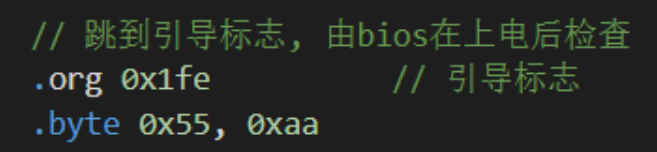

## 最小x86系统

### 启动流程

BIOS工作：

1. 对计算机硬件进行检查、检查计算机中的存储设备（如磁盘）
2. 检查磁盘中的第1个扇区，看看是否有引导标志。如果这样的标志存在，就会将第1个扇区加载到内存的0X7C00这个地址，然后跳转到0X7C00这个地址去运行。*这也就意味着，如果我们想接管计算机的运行控制权，那么就需要在磁盘的第1个扇区添加这样的引导标志。*
3. 磁盘第一个扇区末尾添加 0x55，0xAA 作为引导标志

