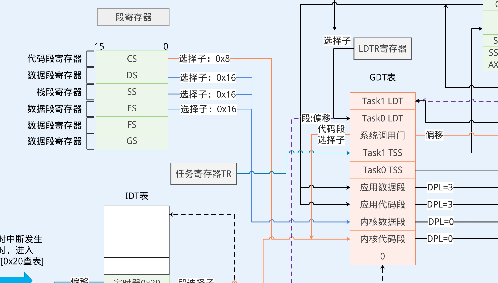

## 最小x86系统

### 启动流程与16位实模式


BIOS工作：

1. 对计算机硬件进行检查、检查计算机中的存储设备（如磁盘）

2. 检查磁盘中的第1个扇区，看看是否有引导标志。如果这样的标志存在，就会将第1个扇区加载到内存的0X7C00这个地址，然后跳转到0X7C00这个地址去运行。*这也就意味着，如果我们想接管计算机的运行控制权，那么就需要在磁盘的第1个扇区添加这样的引导标志。*

3. 磁盘第一个扇区末尾添加 0x55，0xAA 作为引导标志。

   即，从生成的二进制文件os.bin里加载代码进内存中


本项目中只访问了0~64KiB的地址( 64KiB = 2^(10 + 6) )，大抵是因为CPU只有16位。代码段、数据段直接共享，从0开始。因此，段寄存器ds ss es等，都设置为0。qemu启动时会自动将cs设置为0，因此cs可以不用设置。

0x7c00 直接跳到了 _start，可以认为 _start 就是程序的入口点，地址为x7c00

BIOS内置了中断向量表，CPU通过int 13中断，调用BIOS代码，让它调用中断向量表，然后实现将硬盘上的程序加载进内存中


### 保护模式

要运行32位内存的代码则必须进入保护模式，因为CPU必须兼容16位指令，而16位指令，按照intel设计的历史，只能寻址1M。因此在兼容16位寻址方式的前提下，需要想办法设计一个能够寻址32位的方法。保护模式的设计可以做到这样。

#### 段寄存器与GDT表

GDT表是一个数据结构，C语言的体现形式为结构体数组，每个元素是一个64位(8字节)的字段，每个字段储存了不同的信息。



16位实模式下，段寄存器可以通过基址 + 偏移的方式，直接对应到内存里的内容。如上文所述，32位为了兼容，也得这么做，但是因为内存远远大于1M，因此通过GDT表(global descriptor table)来辅助记载偏移信息。

比如：对于某个代码段，指定了在内存中的起始位置，这段代码段有多大，访问权限等。

此时，段寄存器作为“选择子 selector”，作为索引来让CPU访问GDT表的内容。

项目里，编写了以下的宏：

```C
#define KERNEL_CODE_SEG  (8)
#define KERNEL_DATA_SEG  (8 * 2) 
```

表示了内核代码段、内核数据段 针对GDT表的起始偏移量。若要用数组下标访问它们，则需要除以8。


### 中断

当中断发生时，CPU会从IDT表中查找相应的表项，表项指向了内存中中断处理函数的入口地址。


### 进程切换

x86 给进程切换提供了硬件支持。只需要给每个任务配置一个TSS结构表，即可方便地使用一条指令进行切换。任务切换时，寄存器（上下文）会保存在TSS表里。

同样需要在GDT表里记录它的选择子。

目前的做法是通过中断来简单地执行，让中断进入`task_sched()`函数，里面进行task的选择。
